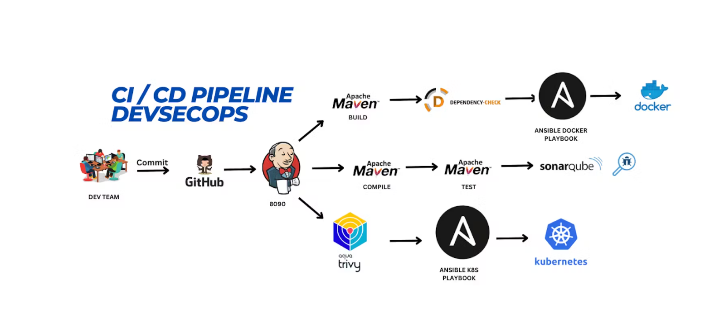
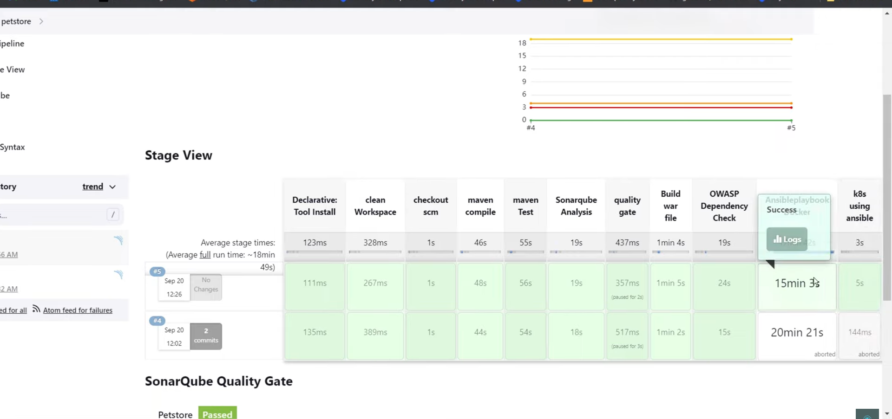
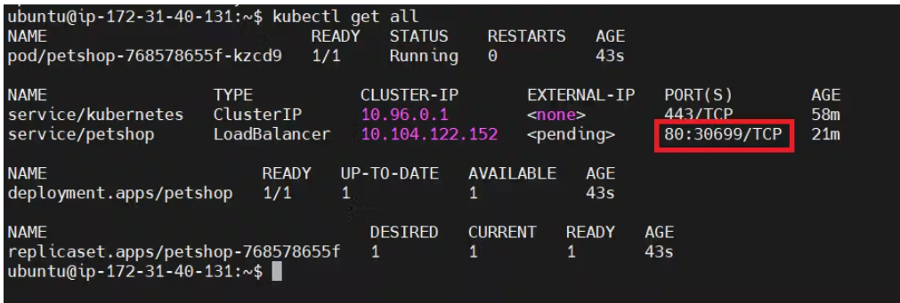
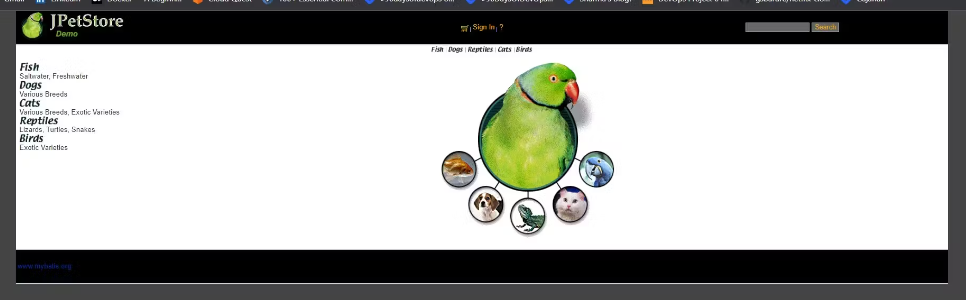

### Deploying a Java-based application called "Petstore" using a CI/CD pipeline with Jenkins and deploying it on a Kubernetes cluster. The goal is to automate the build, test, and deployment processes to ensure a streamlined and reliable deployment of the application.

## Workflow of Project
In this project I am utilizing **Git, Webhooks, Jenkins, SonarQube, Maven, Trivy, OWASP, Docker, Kubernetes, and Ansible**. 

Developers collaborate using Git for version control and code management. When code changes are pushed to the Git repository, it triggers Jenkins pipeline through webhook integrated with Jenkins. Jenkins manages Continuous Integration (CI), encompassing building, testing and packaging the application with Maven. SonarQube analyzes code quality and quality gates. Trivy is used for scanning the File System whereas OWASP for dependency check. By integrating SonarQube, Trivy, and OWASP into your workflow, you can address code quality, file security, and web application security comprehensively, improving the overall security posture of the project.

Upon successful war file generation, Ansible is employed to create a Docker image, subsequently pushed to DockerHub. Kubernetes deployment manifests are prepared and services defined for application exposure. Ansible for Kubernetes is used to apply these manifests.




## Server Setup (Installation)
- **AWS EC2 Instance:** t2.medium
- 
- **Jenkins**
```
sudo wget -O /usr/share/keyrings/jenkins-keyring.asc \
  https://pkg.jenkins.io/debian-stable/jenkins.io-2023.key
echo deb [signed-by=/usr/share/keyrings/jenkins-keyring.asc] \
  https://pkg.jenkins.io/debian-stable binary/ | sudo tee \
  /etc/apt/sources.list.d/jenkins.list > /dev/null
sudo apt-get update
sudo apt-get install jenkins -y

# Password
sudo cat /var/lib/jenkins/secrets/initialAdminPassword

```

- **Docker**
```
sudo apt-get update
sudo apt-get install docker.io -y
sudo usermod -aG docker $USER   #my case is ubuntu
newgrp docker
sudo chmod 777 /var/run/docker.sock

```

- **Sonarqube**
```
docker run -d --name sonar -p 9000:9000 sonarqube:lts-community
```
You can access Sonarqube on port `9000`. Username and Password is same `admin`

- **Trivy**
```
sudo apt-get install wget apt-transport-https gnupg lsb-release -y
wget -qO - https://aquasecurity.github.io/trivy-repo/deb/public.key | gpg --dearmor | sudo tee /usr/share/keyrings/trivy.gpg > /dev/null
echo "deb [signed-by=/usr/share/keyrings/trivy.gpg] https://aquasecurity.github.io/trivy-repo/deb $(lsb_release -sc) main" | sudo tee -a /etc/apt/sources.list.d/trivy.list
sudo apt-get update
sudo apt-get install trivy -y

```

- **Ansible**
```

sudo apt update
sudo apt install software-properties-common
sudo add-apt-repository --yes --update ppa:ansible/ansible
sudo apt install ansible -y

```

- **Install Plugins** 
    - JDK
    - Sonarqube Scanner
    - Maven
    - OWASP Dependency Check
    - Docker
    - Ansible
    - Kubernetes

 and **configure** them.

- ## Kuberenetes Setup (kubeadm) -> Master and Worker Node
  
**Installing Kubectl**
```
sudo apt update
sudo apt install curl
curl -LO https://dl.k8s.io/release/$(curl -L -s https://dl.k8s.io/release/stable.txt)/bin/linux/amd64/kubectl
sudo install -o root -g root -m 0755 kubectl /usr/local/bin/kubectl
kubectl version --client
```


**Commands to be executed on both master and worker node**
```
sudo apt-get update 

sudo apt-get install -y docker.io
sudo usermod –aG docker Ubuntu
newgrp docker
sudo chmod 777 /var/run/docker.sock

sudo curl -s https://packages.cloud.google.com/apt/doc/apt-key.gpg | sudo apt-key add -

sudo tee /etc/apt/sources.list.d/kubernetes.list <<EOF
deb https://apt.kubernetes.io/ kubernetes-xenial main
EOF

sudo apt-get update
sudo apt-get install -y kubelet kubeadm kubectl
sudo snap install kube-apiserver

```

**Only on Master node** without root priviliges
```
sudo kubeadm init --pod-network-cidr=10.244.0.0/16
mkdir -p $HOME/.kube
sudo cp -i /etc/kubernetes/admin.conf $HOME/.kube/config
sudo chown $(id -u):$(id -g) $HOME/.kube/config
kubectl apply -f https://raw.githubusercontent.com/coreos/flannel/master/Documentation/kube-flannel.yml
```

**Only on Worker node**
```
sudo kubeadm join <master-node-ip>:<master-node-port> --token <token> --discovery-token-ca-cert-hash <hash>
```

## Kubernetes and Ansible Integration
Since I am deploying the petstore applicationon on kubernetes cluster using Ansible Playbook, so to communicate with the Kubernetes clients we have to generate an SSH key on the ansible server
and exchange it with kubernetes Master server.

```
-----------  Ansible server ----------
ssh-keygen      
cd .ssh
cat id_rsa.pub  # copy this public key

-----------  kubernetes server ----------
cd .ssh #on k8s master 
sudo vi authorized_keys    # Paste the opied public key here

# verify the ssh connection
ssh ubuntu@<public-ip-k8s-master>

```

Also, add the public ip of kubernetes master node in ansible hosts file 
```
sudo vi /etc/ansible/hosts

# Add
[k8s]            # for k8s
54.232.200.77

[docker]     # for docker build nad push
3.227.102.13

# Test connection
ansible -m ping k8s
ansible -m ping all    

```


**Ansible playbook for Kubernetes deployment.**
```
---
- name: Deploy Kubernetes Application
  hosts: k8s  # Replace with your target Kubernetes master host or group
  gather_facts: yes  # Gather facts about the target host

  tasks:
    - name: Copy deployment.yaml to Kubernetes master
      copy:
        src: /var/lib/jenkins/workspace/petstore/deployment.yaml  # Jenkins workspace
        dest: /home/ubuntu/
      become: yes  # Use sudo for copying if required
      become_user: root  # Use a privileged user for copying if required

    - name: Apply Deployment
      command: kubectl apply -f /home/ubuntu/deployment.yaml
```


**Ansible playbook for Docker Image.**
```
- name: Docker build and push
  hosts: docker  # Replace with the hostname or IP address of your target server
  become: yes  # Run tasks with sudo privileges

  tasks:
    - name: Update apt package cache
      apt:
        update_cache: yes   

    - name: Build Docker Image
      command: docker build -t petstore .
      args:
        chdir: /var/lib/jenkins/workspace/petstore

    - name: Tag Image
      command: docker tag petstore:latest asa96/petstore:latest 

    - name: Log in to Docker Hub
      community.docker.docker_login:
        registry_url: https://index.docker.io/v1/
        username: asa96
        password: <docker pat>

    - name: Push image
      command: docker push asa96/petstore:latest

```

## Pipeline Script

```
pipeline{
    agent any
    tools{
        jdk 'jdk17'
        maven 'maven3'
    }
	
    environment {
        SCANNER_HOME=tool 'sonar-scanner'
    }
	
    stages {
	
        stage('Clean Workspace'){
            steps{
                cleanWs()
            }
        }
		
        stage('Git Checkout'){
            steps{
                git branch: 'main', url: ''
            }
        }
		
		stage ('MVN Compile') {
            steps {
                sh 'mvn clean compile'
            }
        }
		
        stage ('MVN Test') {
            steps {
                sh 'mvn test'
            }
        }
		
        stage('Sonarqube Code Analysis'){
            steps{
                withSonarQubeEnv('sonar-server') {
                    sh ''' $SCANNER_HOME/bin/sonar-scanner \
		    -Dsonar.projectName=Petstore \
                    -Dsonar.projectKey=Petstore'''
                }
            }
        }
		
        stage('Quality Gate Status'){
           steps {
                script {
                    waitForQualityGate abortPipeline: false, credentialsId: 'sonar-token' 
                }
            } 
        }

	stage ('Build War File'){
            steps{
                sh 'mvn clean install -DskipTests=true'
            }
        }

        stage('OWASP FS SCAN') {
            steps {
                dependencyCheck additionalArguments: '--scan ./ --disableYarnAudit --disableNodeAudit', odcInstallation: 'DP-Check'
                dependencyCheckPublisher pattern: '**/dependency-check-report.xml'
            }
        }
		
        stage('Scan Files: TRIVY') {
            steps {
                sh "trivy fs . > trivy-fs.txt"
            }
        }
		
        stage ("Docker Build & Tag") {
            steps {
                dir('ansible-plays'){
					script {
						ansiblePlaybook credentialsId: 'ssh', 
						disableHostKeyChecking: true, 
						installation: 'ansible', 
						inventory: '/etc/ansible/', 
						playbook: 'docker.yaml'
					}
				}
            }
        }
		
	stage('k8s deployment using Ansible'){
            steps{
                dir('ansible-plays'){
                    script{
                        ansiblePlaybook credentialsId: 'ssh', 
						disableHostKeyChecking: true, 
						installation: 'ansible', 
						inventory: '/etc/ansible/', 
						playbook: 'kube.yaml'
                    }
                } 
            }
        }	
   }
}

```



Verify the kubernetes resources
```
kubectl get all
```



Grab the service port to access the application.



**Congratulations for successful deployment!!!!!**


